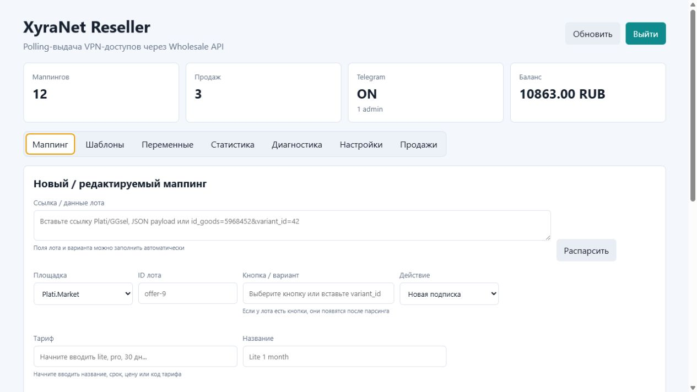
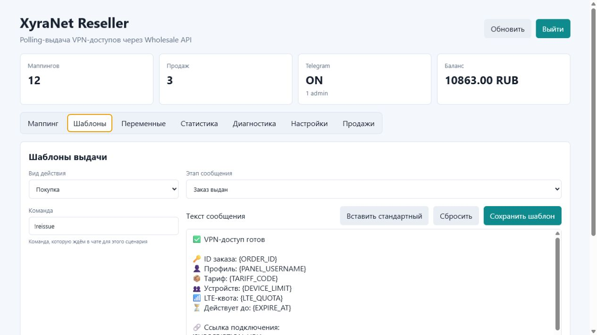
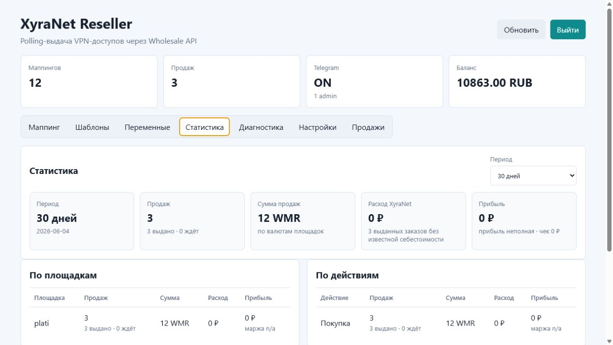
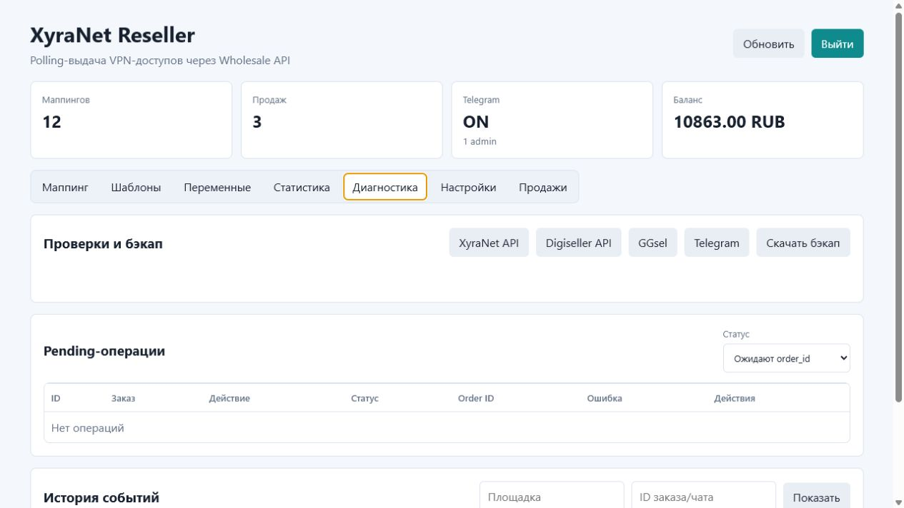
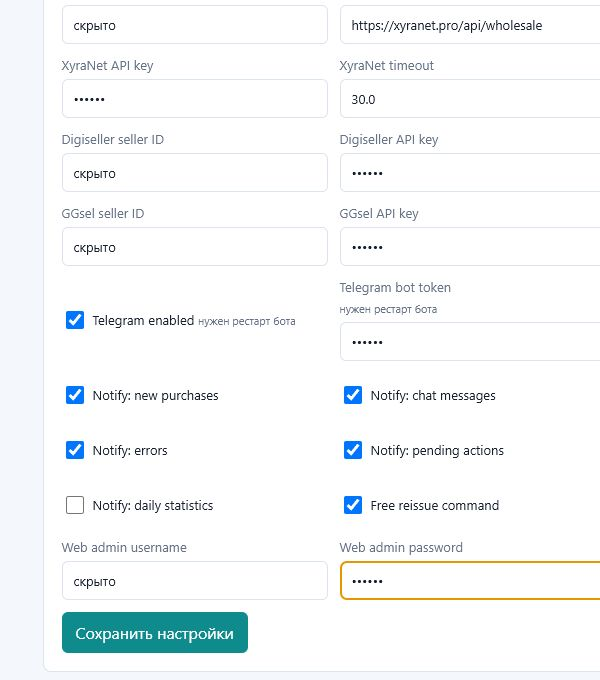

# XyraNet Reseller Autoseller

Веб-панель и Telegram-бот для автоматической выдачи VPN-доступов XyraNet после покупок на Plati.Market/Digiseller и GGsel.

Покупатель общается только в чате маркетплейса. Программа сама видит продажу, проверяет заказ, создаёт или изменяет подписку XyraNet и отправляет результат в чат заказа. Telegram-бот нужен владельцу и администраторам: получать уведомления, смотреть статистику, управлять настройками и быстро находить проблемные заказы.

## Навигация

**Быстрый старт**

- [Что умеет](#что-умеет)
- [Как работает продажа](#как-работает-продажа)
- [Что подготовить заранее](#что-подготовить-заранее)
- [Минимальные системные требования](#минимальные-системные-требования)
- [Что должно быть установлено](#что-должно-быть-установлено)
- [Где купить сервер и домен](#где-купить-сервер-и-домен)
- [Быстрый старт на Ubuntu](#быстрый-старт-на-ubuntu)
- [Установка на Windows для локальной проверки](#установка-на-windows-для-локальной-проверки)

**Доступ к панели**

- [Как установщик защищает панель](#как-установщик-защищает-панель)
- [Как открыть панель](#как-открыть-панель)
- [Первый вход](#первый-вход)

**Настройка и работа**

- [Основные экраны](#основные-экраны)
- [Настройка после установки](#настройка-после-установки)
- [Диагностика](#диагностика)
- [Обновления](#обновления)
- [Маппинг товаров](#маппинг-товаров)
- [Шаблоны и переменные](#шаблоны-и-переменные)
- [Продажи и статистика](#продажи-и-статистика)
- [Telegram-бот для админов](#telegram-бот-для-админов)
- [Проверка тестовой покупки](#проверка-тестовой-покупки)
- [Проверка расхода RAM и CPU](#проверка-расхода-ram-и-cpu)

**Помощь и обслуживание**

- [Если заказ не обработался](#если-заказ-не-обработался)
- [Обслуживание сервера](#обслуживание-сервера)
- [Резервная копия](#резервная-копия)
- [Безопасность](#безопасность)
- [Контакты](#контакты)

## Что умеет

- Автоматическая выдача новых подписок XyraNet.
- Продление существующих подписок.
- Перевыпуск подписки.
- Докупка LTE-трафика.
- Докупка лимита устройств/IP.
- Маппинг лотов, кнопок и тарифов через веб-панель.
- Редактируемые шаблоны сообщений для каждого сценария.
- Пользовательские переменные для больших блоков текста.
- Статистика продаж, выручки, расходов и прибыли.
- Метрики нагрузки сервера: CPU, RAM, диск, uptime и память процесса.
- История событий по заказам и повторная отправка сохранённой выдачи.
- Уведомления админам в Telegram.
- Локальная история переписки Digiseller с ответами и быстрыми заготовками прямо в Telegram.
- Работа без публичного HTTP-доступа к панели.
- Проверка и запуск обновлений из веб-панели и Telegram-бота.

## Как работает продажа

| Площадка | Как обрабатывается заказ |
| --- | --- |
| Plati.Market/Digiseller | Digiseller присылает URL-уведомление о продаже, панель просит покупателя отправить уникальный код в чат заказа, затем по уведомлению о сообщении проверяет код и отправляет выдачу туда же. |
| GGsel | Панель опрашивает GGsel API, видит новые продажи и отправляет выдачу в чат заказа. |

Для Digiseller основной режим — URL-уведомления о продажах и сообщениях. `Fallback polling Digiseller` по умолчанию выключен из-за суточного лимита read-запросов. Если аварийный fallback включить вручную, он раз в 5 минут проверяет только непрочитанные чаты и не перебирает каждый известный заказ.

Если покупатель на Plati.Market/Digiseller оплатил товар, но не прислал уникальный код, панель может сама написать ему в чат заказа и попросить отправить 16-значный код. По умолчанию сообщение уходит через 5 минут после оплаты. Задержка задаётся в `Настройки` -> `Задержка запроса кода, мин`, а текст меняется в `Шаблоны` -> `Digiseller` -> `Покупатель не прислал уникальный код`.

При выдаче Plati.Market/Digiseller программа проверяет не только сам код, но и то, что код относится именно к заказу из текущего чата. Код от другой покупки не выдаст товар и не будет отмечен как доставленный.

## Что подготовить заранее

| Что нужно | Где взять |
| --- | --- |
| XyraNet API key | В личном кабинете XyraNet, в разделе для реселлеров/wholesale API. |
| Баланс XyraNet | Пополняется на стороне XyraNet, не в этой панели. |
| Telegram bot token | В BotFather. Можно добавить позже в панели. |
| Telegram ID главного админа | Ваш Telegram ID. Это обязательное поле при установке. |
| Digiseller seller ID и API key | В кабинете Digiseller, если продаёте на Plati.Market/Digiseller. |
| GGsel seller ID и API key | В кабинете GGsel, если продаёте на GGsel. |
| Домен | Нужен только если хотите открывать панель по HTTPS-адресу вида `https://panel.example.com`. |

Официальные ссылки XyraNet:

- Сайт: [https://xyranet.pro](https://xyranet.pro)
- Telegram-бот: [@xyranet_bot](https://t.me/xyranet_bot)
- Wholesale API docs: [https://xyranet.pro/wholesale-api-docs](https://xyranet.pro/wholesale-api-docs)
- API URL для панели: `https://xyranet.pro/api/wholesale`

Чтобы взять API key, откройте сайт XyraNet, войдите в аккаунт, найдите раздел для реселлеров/wholesale API и скопируйте ключ. Затем вставьте его в нашей панели: `Настройки` -> `XyraNet API key`.

Баланс пополняйте на сайте XyraNet или через официальный Telegram-бот [@xyranet_bot](https://t.me/xyranet_bot). После пополнения откройте в нашей панели `Диагностика` и проверьте `XyraNet API`.

## Минимальные системные требования

### Linux-сервер

| Режим | CPU | RAM | Диск | Комментарий |
| --- | --- | --- | --- | --- |
| Минимум | 1 vCPU | 512 MB | 1 GB свободно | Подходит для небольшого магазина и тестового запуска. |
| Рекомендуется | 1 vCPU | 1 GB | 5 GB свободно | Лучше для постоянной работы, логов, базы и запаса под обновления. |

Панель работает на Python/FastAPI, SQLite и polling-задачах. Она не требует мощного сервера, но для реальных продаж лучше не ставить её на VPS с памятью меньше 1 GB.

### Windows для локальной проверки

| Режим | CPU | RAM | Диск | Комментарий |
| --- | --- | --- | --- | --- |
| Минимум | 2 ядра | 1 GB свободной RAM | 1 GB свободно | Достаточно для локальной проверки. |
| Рекомендуется | 2+ ядра | 2 GB свободной RAM | 2 GB свободно | Комфортнее для тестов, браузера и логов. |

Windows-вариант лучше использовать для проверки и настройки, а не для постоянных продаж.

### Измерение в простое

Локальный Windows-замер в режиме без Telegram и без marketplace-ключей:

| ОС | Python | RAM RSS avg/max | CPU avg/max |
| --- | --- | --- | --- |
| Windows 11 x64 | 3.12.13 | 157.5 MB / 157.6 MB | 0.01% / 0.10% |

Linux-цифры лучше измерить прямо на вашем сервере, потому что они зависят от VPS, Python-сборки и окружения. Для этого в проекте есть отдельный скрипт, команды ниже.

## Что должно быть установлено

`requirements.txt` содержит только Python-библиотеки проекта. Системные программы и сам Python туда не входят.

### Python

Поддерживаемая версия Python: **3.10-3.12**.

Рекомендуемая версия: **Python 3.12**. Проект проверялся на Python `3.12.13`.

Python ниже `3.10` не поддерживается. Python `3.13+` пока не указан как поддерживаемый, потому что зависимости и установочные сценарии должны быть отдельно проверены на этой ветке.

### Linux

Для Ubuntu/Debian быстрый установщик сам:

- обновляет индекс пакетов через `apt-get update`;
- обновляет установленные системные пакеты через `apt-get upgrade -y`;
- ставит нужные системные пакеты;
- проверяет Python и использует поддерживаемую версию `3.10-3.12`;
- если на Ubuntu системный Python слишком старый, пробует поставить Python `3.12` через deadsnakes PPA.

Пакеты, которые ставятся или используются установщиком:

| Что | Зачем нужно |
| --- | --- |
| `python3` | Запуск приложения. |
| `python3-venv` | Создание отдельного виртуального окружения `.venv`. |
| `python3-pip` | Установка Python-библиотек из `requirements.txt`. |
| `git` | Загрузка проекта с GitHub и обновления. |
| `rsync` | Копирование проекта при локальной установке из папки. |
| `openssl` | Генерация безопасных значений и работа системных компонентов. |
| `curl` | Запуск быстрой установки одной командой. |
| `build-essential` | Компилятор и базовые инструменты сборки на случай, если Python-зависимость нужно собрать из исходников. |
| `python3-dev` | Заголовочные файлы Python для сборки некоторых Python-зависимостей. |
| `systemd` | Автозапуск сервиса после перезагрузки сервера. |

Если выбираете установку с доменом и HTTPS, установщик дополнительно ставит `nginx`, `certbot` и `python3-certbot-nginx`.

Если по какой-то причине не хотите обновлять уже установленные системные пакеты, можно запустить установщик с `SKIP_SYSTEM_UPGRADE=1`. Индекс пакетов и недостающие зависимости всё равно будут установлены.

### Windows

Для Windows нужны:

| Что | Зачем нужно |
| --- | --- |
| Python `3.10-3.12` | Запуск приложения. При установке Python включите добавление в PATH или используйте Python Launcher `py`. |
| Git for Windows | Удобное скачивание проекта и обновления через Git. |
| PowerShell | Запуск Windows-установщика. Обычно уже есть в Windows. |
| Браузер | Работа с веб-панелью. |
| OpenSSH Client | Нужен только если хотите подключаться к удалённому серверу через SSH-туннель. Обычно уже есть в Windows 10/11. |

SQLite отдельно устанавливать не нужно: он используется через стандартную поддержку Python.

## Где купить сервер и домен

Для постоянной работы лучше использовать отдельный VPS/VDS на Ubuntu. Сервер можно взять здесь: [купить сервер для панели](https://rdp-onedash.ru/r/6d61f).

Если хотите открывать веб-панель по красивому HTTPS-адресу, нужен домен. Домен можно зарегистрировать здесь: [купить домен для панели](https://www.reg.ru/?rlink=reflink-31958333).

Домен не обязателен. Если домена нет, панель всё равно можно безопасно открывать через SSH-туннель.

## Быстрый старт на Ubuntu

На сервере выполните:

```bash
sudo apt-get update && sudo apt-get install -y curl ca-certificates && curl -fsSL https://raw.githubusercontent.com/Seno47/vpn-reseller-autoseller/main/scripts/install-linux.sh | sudo env REPO_URL=https://github.com/Seno47/vpn-reseller-autoseller.git bash
```

Во время установки скрипт обновит систему, поставит Python и остальные зависимости, создаст сервис systemd и запустит приложение.

Установщик спросит данные:

| Вопрос | Что ввести |
| --- | --- |
| `Web panel login` | Логин для входа в панель, например `admin`. |
| `Web panel password` | Надёжный пароль, минимум 8 символов. |
| `Interface and Telegram bot language` | `ru` для русского интерфейса или `en` для английского. Шаблоны выдачи не переводятся автоматически. |
| `Telegram bot token` | Токен бота от BotFather. Можно оставить пустым и заполнить позже. |
| `Telegram admin ID` | Ваш Telegram ID. Обязательное поле. |
| `XyraNet API key` | Ключ XyraNet. Можно оставить пустым и заполнить позже. |
| `Digiseller seller ID` | ID продавца Digiseller. Если пока не используете, оставьте пустым. |
| `Digiseller API key` | API key Digiseller. Если пока не используете, оставьте пустым. |
| `GGsel seller ID` | ID продавца GGsel. Если пока не используете, оставьте пустым. |
| `GGsel API key` | API key GGsel. Если пока не используете, оставьте пустым. |
| `Use domain with HTTPS?` | `yes`, если есть домен. `no`, если домена нет. |
| `Domain name` | Домен панели, например `panel.example.com`. Спрашивается только при `yes`. |
| `Email for Let's Encrypt` | Почта для выпуска HTTPS-сертификата. Спрашивается только при `yes`. |

Пароли и API-ключи при вводе не показываются.

## Как установщик защищает панель

Приложение слушает только `127.0.0.1:8095`. Это значит, что обычный HTTP-порт панели не открыт наружу.

Если вы выбрали домен, установщик поставит Nginx, выпустит HTTPS-сертификат Let's Encrypt и откроет панель по HTTPS.

Если домена нет, панель открывается через SSH-туннель. Это подходит даже для сервера без выделенного IP, если к нему можно подключиться по SSH.

## Как открыть панель

### Если есть домен

Откройте в браузере:

```text
https://ваш-домен
```

Например:

```text
https://panel.example.com
```

### Если домена нет

На своём компьютере выполните:

```bash
ssh -L 8095:127.0.0.1:8095 user@server
```

Где:

- `user` - имя пользователя на сервере;
- `server` - IP, домен или SSH-адрес сервера.

После этого откройте в браузере на своём компьютере:

```text
http://127.0.0.1:8095
```

Если SSH работает на другом порту:

```bash
ssh -p 2222 -L 8095:127.0.0.1:8095 user@server
```

В браузере будет обычный `http://127.0.0.1`, но соединение до сервера идёт внутри SSH-туннеля.

## Установка из приватного репозитория

Если репозиторий приватный, сначала войдите на сервер под аккаунтом, у которого есть доступ к GitHub, затем выполните:

```bash
git clone https://github.com/Seno47/vpn-reseller-autoseller.git
cd vpn-reseller-autoseller
sudo bash scripts/install-linux.sh
```

## Установка на Windows для локальной проверки

Откройте PowerShell в папке проекта:

```powershell
powershell -ExecutionPolicy Bypass -File .\scripts\install-windows.ps1
.\.venv\Scripts\python.exe run.py
```

Установщик спросит:

- `ADMIN_IDS`
- `ADMIN_USERNAME`
- `ADMIN_PASSWORD`
- язык интерфейса `ru/en`
- `XYRANET_API_KEY`, если сразу проверяете XyraNet
- `TELEGRAM_BOT_TOKEN`, если нужен Telegram-бот
- `DIGISELLER_SELLER_ID` и `DIGISELLER_API_KEY`, если проверяете Digiseller
- `GGSEL_SELLER_ID` и `GGSEL_API_KEY`, если проверяете GGsel

После входа панель выдаёт временную сессию автоматически. При перезапуске приложения или смене логина/пароля активные сессии сбрасываются, и нужно войти заново.

После запуска откройте:

```text
http://127.0.0.1:8095
```

## Первый вход

1. Откройте панель.
2. Введите логин и пароль, которые указали при установке.
3. Нажмите `Войти`.

Если пароль потерян, поменяйте `ADMIN_PASSWORD` в `.env` и перезапустите сервис.

## Основные экраны

### Маппинг товаров

Здесь связываются лоты и кнопки маркетплейсов с действиями и тарифами XyraNet.



### Шаблоны сообщений

Здесь редактируются тексты, которые покупатель получает в чате маркетплейса.



### Статистика

Здесь видно продажи, выручку, расходы и прибыль за выбранный период.



### Диагностика

Здесь проверяются подключения, нагрузка сервера, pending-заказы, история событий и резервная копия базы.



### Настройки

Здесь заполняются ключи XyraNet, Digiseller, GGsel, Telegram и доступы к панели. На скриншоте значения скрыты.



## Настройка после установки

Откройте `Настройки` и заполните:

- `XyraNet API URL` - оставьте `https://xyranet.pro/api/wholesale`;
- `Язык интерфейса` - выберите русский или английский язык для подписей настроек, Telegram-бота и админских уведомлений. Шаблоны выдачи остаются такими, как вы их написали;
- `XyraNet API key` - ключ из личного кабинета XyraNet;
- `Digiseller seller ID` и `Digiseller API key` - если используете Plati.Market/Digiseller;
- `GGsel seller ID` и `GGsel API key` - если используете GGsel;
- `Telegram enabled` - включено, если нужен Telegram-бот;
- `Telegram bot token` - токен от BotFather;
- уведомления - включите те, которые хотите получать;
- `Free reissue command` - включите, если хотите разрешить бесплатный перевыпуск по команде в чате заказа.

После изменения Telegram token или включения/отключения Telegram нажмите `Рестарт Telegram-бота`.

Важно:

- Если Digiseller-поля пустые, Plati.Market/Digiseller не будет обрабатываться.
- Если GGsel-поля пустые, GGsel не будет обрабатываться.
- Для Digiseller желательно настроить URL-уведомления. Готовые ссылки показаны в разделе `Настройки` -> `URL-уведомления Digiseller`.

### URL-уведомления Digiseller

Откройте в Digiseller: `Личный кабинет` -> `Уведомления` -> `URL`.

Во вкладке `Продажа товара`:

1. Скопируйте из панели URL `Продажа товара`.
2. Вставьте его в поле `URL для получения уведомлений о продаже товаров`.
3. Выберите метод `POST`.
4. Сохраните.

Во вкладке `Сообщения`:

1. Скопируйте из панели URL `Сообщения`.
2. Вставьте его в поле `URL для получения уведомлений о новых сообщениях`.
3. Выберите метод `POST`.
4. Включите `передавать тело сообщения`.
5. Сохраните.

Если у сервера есть домен, укажите его в настройке `Base URL`, например `https://panel.example.com`. Если домена нет, используйте публичный URL reverse tunnel, например Cloudflare Tunnel или ngrok, и тоже укажите его в `Base URL`. Обычный SSH-туннель подходит для входа в панель с вашего компьютера, но не подходит для входящих уведомлений Digiseller.

Если включена проверка `Проверять SHA256 продажи Digiseller`, заполните `Пароль SHA256 уведомлений Digiseller`. Если подпись Digiseller не совпадает, уведомление о продаже будет отклонено и запрос уникального кода не отправится. При использовании длинного секретного URL можно временно отключить SHA256-проверку, пока не настроите пароль.

## Диагностика

После настроек откройте `Диагностика` и нажмите проверки:

| Проверка | Что означает |
| --- | --- |
| `XyraNet API` | Ключ XyraNet работает, панель видит API и баланс. |
| `Digiseller API` | Данные Digiseller заполнены верно. |
| `GGsel` | Данные GGsel заполнены верно. |
| `Telegram` | Админам отправляется тестовое уведомление. |

Если проверка не прошла, исправьте ключи в настройках и проверьте ещё раз.

## Обновления

В разделе `Диагностика` есть карточка `Обновления`.

- `Проверить обновление` - вручную проверяет GitHub на наличие новой версии.
- `Обновить` - запускает обновление только после вашего нажатия и подтверждения.
- Автопроверка выполняется примерно раз в 12 часов, но автоматическая установка не выполняется.

В Telegram-боте владелец из `ADMIN_IDS` может отправить команду `/update`. Бот покажет текущую и последнюю версию, а если обновление доступно - предложит инлайн-кнопку с подтверждением.

На Linux установщик добавляет отдельный host-updater. Панель сама не получает root-доступ и не управляет Docker напрямую: она только создаёт файл-сигнал с ID запроса в `data/update-request.json`. Адрес репозитория и ветка берутся только из root-owned systemd unit; содержимое request-файла не может их переопределить. Статус systemd-обновления хранится в root-owned каталоге `/run/xyranet-reseller-autoseller/`.

Код, `.venv` и бэкапы принадлежат `root`, файл `.env` имеет режим `0640` (`root:xyranet-reseller`), а сервисный пользователь может записывать только в `data`. После доверенного обновления host-updater также безопасно обновляет собственную копию в `/usr/local/sbin`.

Если Linux-инсталляция была создана старой версией установщика, один раз повторно запустите актуальный `sudo bash scripts/install-linux.sh`. Это обновит host-updater, systemd unit и права файлов; перед запуском скачайте резервную копию базы и подготовьте текущие значения секретов для повторного ввода. Последующие обновления обновляют host-updater автоматически.

На Windows доступна проверка обновлений. Кнопка установки будет активна только если вы отдельно настроили команду обновления в окружении.

## Маппинг товаров

Маппинг говорит панели: если купили конкретный лот или кнопку, нужно выполнить конкретное действие и выдать конкретный тариф.

### Как добавить товар

1. Откройте `Маппинг`.
2. В поле `Ссылка / данные лота` вставьте ссылку на лот Plati/GGsel или данные лота.
3. Нажмите `Распарсить`.
4. Проверьте площадку и ID лота.
5. В поле `Кнопка / вариант` выберите кнопку из списка.
6. Выберите действие.
7. Выберите тариф из выпадающего списка.
8. Заполните параметры действия, если они появились.
9. Введите понятное название, например `LITE 30 дней`.
10. Нажмите `Сохранить`.

После сохранения форма не сбрасывается. Можно сразу выбрать следующую кнопку того же лота и сохранить её.

Уже добавленные кнопки убираются из выбора, чтобы не запутаться. В списке готового маппинга есть поиск, редактирование и удаление.

### Действия

| Действие | Когда использовать |
| --- | --- |
| `Покупка` | Новая подписка. Если покупатель купил несколько штук одного товара, панель создаёт одну подписку и сразу продлевает её на нужное количество периодов. |
| `Продление` | Продление существующего заказа XyraNet. Лучше делать отдельным лотом. |
| `Перевыпуск` | Перевыпуск подписки. Можно сделать бесплатным по команде или платным отдельным лотом. |
| `LTE-трафик` | Докупка LTE-квоты для существующего заказа. |
| `IP-лимит` | Докупка лимита устройств/IP для существующего заказа. |

Для продления, LTE-трафика и IP-лимита покупатель после оплаты должен написать ID заказа XyraNet в чат заказа маркетплейса. Текст просьбы и команды редактируются в шаблонах.

## Шаблоны и переменные

Откройте `Шаблоны`, чтобы менять сообщения, которые уходят покупателю в чат маркетплейса.

Шаблоны разделены по действиям и стадиям:

- покупка;
- продление;
- перевыпуск;
- LTE-трафик;
- IP-лимит;
- запрос уникального кода Digiseller;
- ожидание ID заказа;
- успешное выполнение;
- ошибка;
- подсказка по командам.

Переменные пишутся в фигурных скобках, например `{ORDER_ID}`. При отправке сообщения программа заменяет их реальными данными заказа. Если переменная в конкретном заказе неизвестна, вместо неё будет пустое место.

| Переменная | Что подставляется | Где чаще всего нужна |
| --- | --- | --- |
| `{ORDER_ID}` | ID заказа XyraNet. | Выдача подписки, продление, перевыпуск, LTE-трафик, IP-лимит. |
| `{SUBSCRIPTION_URL}` | Ссылка подписки, которую покупатель импортирует в VPN-клиент. | Покупка и перевыпуск. |
| `{PANEL_USERNAME}` | Имя профиля в панели XyraNet, если оно пришло из API. | Технические сообщения и поддержка. |
| `{TARIFF_CODE}` | Код тарифа из XyraNet, например `lite_monthly`. | Выдача, продление, внутренние пояснения. |
| `{EXPIRE_AT}` | Дата окончания подписки из ответа XyraNet. | Покупка, продление, перевыпуск. |
| `{DEVICE_LIMIT}` | Лимит устройств/IP, который пришёл из API. | Покупка, продление, увеличение IP-лимита. |
| `{LTE_QUOTA}` | LTE-квота из API или из параметров купленного действия. | Покупка и докупка LTE-трафика. |
| `{PURCHASE_QUANTITY}` | Количество купленных единиц товара. | Лоты, где покупатель может купить несколько месяцев или несколько одинаковых услуг. |
| `{ACTION_LABEL}` | Название текущего действия: покупка, продление, перевыпуск, LTE-трафик или IP-лимит. | Универсальные шаблоны ошибок и ожидания. |
| `{COMMAND}` | Команда без параметров, например `!renew` или `!reissue`. | Сообщения, где нужно объяснить, какую команду отправить. |
| `{COMMAND_EXAMPLE}` | Готовый пример команды с ID заказа, например `!renew {ORDER_ID}`. | Сообщения ожидания ID заказа. |
| `{COMMAND_HELP}` | Большой редактируемый блок подсказки по командам. | Основной шаблон покупки, если хотите сразу рассказать про перевыпуск и дополнительные действия. |
| `{MARKETPLACE_ORDER_ID}` | Номер заказа или чата на площадке. | Запрос уникального кода, служебные сообщения по маркетплейсу. |
| `{PRODUCT_ID}` | ID купленного товара на площадке. | Запрос уникального кода и диагностика. |
| `{PRODUCT_TITLE}` | Название товара из маппинга или данных площадки. | Более дружелюбные сообщения покупателю. |
| `{BUYER_EMAIL}` | Email покупателя, если площадка передала его через API. | Редкие служебные шаблоны. |
| `{PURCHASE_AMOUNT}` | Сумма покупки. | Служебные шаблоны и уточнения по заказу. |
| `{PURCHASE_CURRENCY}` | Валюта покупки. | Служебные шаблоны и уточнения по заказу. |
| `{UNIQUE_CODE_STATE}` | Числовой статус уникального кода Digiseller. | Диагностика и служебные шаблоны. |
| `{CODE_ORDER_ID}` | Номер заказа Digiseller, которому принадлежит присланный уникальный код. | Шаблон ошибки, если покупатель прислал код от другого заказа. |
| `{ERROR}` | Текст ошибки, если действие не удалось выполнить. | Шаблоны ошибок. |

Старый формат `${order_id}` тоже поддерживается, но лучше использовать новый формат `{ORDER_ID}`. Так шаблоны проще читать и редактировать кнопками в веб-панели.

Во вкладке `Переменные` можно редактировать большие блоки текста отдельно от шаблонов. Например, `{COMMAND_HELP}` можно менять один раз, а потом вставлять в разные шаблоны.

Там же можно создать свою переменную. Для названия используйте латиницу, цифры и подчёркивание, например `CUSTOM_SUPPORT_TEXT`. Внутри своей переменной можно использовать обычные переменные:

```text
Ваш заказ: {ORDER_ID}
Тариф: {TARIFF_CODE}
Поддержка: напишите продавцу в чат заказа.
```

После сохранения переменную можно вставлять в шаблоны как `{CUSTOM_SUPPORT_TEXT}`.

## Продажи и статистика

Во вкладке `Продажи` можно:

- увидеть полученные заказы;
- проверить, выдан ли доступ;
- открыть историю событий;
- повторно отправить сохранённую выдачу покупателю;
- понять, почему заказ ждёт ID заказа.

Если покупатель пишет, что ничего не пришло, сначала проверьте `Продажи`.

Во вкладке `Статистика` видно:

- количество продаж;
- сумму продаж;
- расходы на XyraNet;
- прибыль;
- средний заказ;
- разбивку по площадкам;
- разбивку по действиям;
- разбивку по тарифам;
- динамику по дням.

Периоды: сегодня, вчера, 7 дней, 30 дней, 90 дней или всё время.

## Telegram-бот для админов

Telegram-бот нужен администраторам, не покупателям.

Он может:

- присылать уведомления о новых покупках;
- присылать сообщения из чатов маркетплейсов;
- показывать по кнопке `📚 Больше` последние сообщения из локальной базы без запроса к Digiseller;
- отвечать покупателю после предпросмотра и подтверждения;
- создавать, редактировать, включать и отключать быстрые заготовки ответов;
- показывать статистику;
- показывать нагрузку сервера;
- помогать управлять настройками;
- показывать pending-операции;
- перезапускать Telegram-бота после изменения настроек.

Главный админ из `ADMIN_IDS` защищён: его нельзя отключить или удалить. Добавлять других пользователей могут только админы из `ADMIN_IDS`.

Входящие сообщения, автоматические ответы и ответы операторов сохраняются в локальной базе. Для однократного импорта последних 200 сообщений уже известных Digiseller-чатов можно запустить:

```bash
python scripts/backfill_digiseller_chat_history.py --max-chats 200
```

Скрипт делает не больше одного read-запроса на выбранный чат, не помечает сообщения прочитанными и безопасно пропускает уже импортированные записи. Кнопки Telegram после импорта работают только с локальной базой.

## Проверка тестовой покупки

### Plati.Market/Digiseller

1. Заполните Digiseller seller ID и API key.
2. Проверьте Digiseller во вкладке `Диагностика`.
3. Настройте URL-уведомления Digiseller в разделе `Настройки`.
4. Добавьте маппинг нужного лота и кнопки.
5. Сделайте тестовую покупку.
6. Отправьте уникальный код покупки в чат заказа на Plati.Market/Digiseller.
7. Проверьте, что панель отправила подписку в тот же чат.
8. Проверьте вкладку `Продажи`.

Если тестовый покупатель не отправит уникальный код сам, после настроенной задержки панель отправит в чат заказа подсказку с просьбой прислать код. Это сообщение редактируется в разделе `Шаблоны`.

### GGsel

1. Заполните GGsel seller ID и API key.
2. Проверьте GGsel во вкладке `Диагностика`.
3. Добавьте маппинг нужного лота и кнопки.
4. Сделайте тестовую покупку.
5. Подождите один цикл обработки.
6. Проверьте, что панель отправила подписку в чат GGsel.
7. Проверьте вкладку `Продажи`.

## Если заказ не обработался

Проверьте по порядку:

1. Заполнены ли ключи нужной площадки.
2. Проходит ли проверка площадки во вкладке `Диагностика`.
3. Есть ли маппинг для этого лота и кнопки.
4. Включён ли маппинг.
5. Правильно ли выбрано действие.
6. Не ждёт ли заказ ID заказа во вкладке `Продажи` или `Диагностика`.
7. Есть ли ошибка в истории событий заказа.
8. Для Plati.Market/Digiseller: отправил ли покупатель уникальный код именно в чат заказа маркетплейса.
9. Для GGsel: совпадает ли ID лота/кнопки в маппинге с тем, что пришло в заказе.

## Обслуживание сервера

Проверить состояние:

```bash
sudo systemctl status xyranet-reseller-autoseller
```

Посмотреть журнал:

```bash
sudo journalctl -u xyranet-reseller-autoseller -f
```

Перезапустить:

```bash
sudo systemctl restart xyranet-reseller-autoseller
```

Обновить проект вручную, если кнопка обновления недоступна (установленная папка специально не содержит `.git`):

```bash
UPDATE_DIR="$(mktemp -d)"
git clone https://github.com/Seno47/vpn-reseller-autoseller.git "$UPDATE_DIR"
cd "$UPDATE_DIR"
sudo bash scripts/install-linux.sh
```

Установщик сохранит рабочую базу и каталог `data`, но повторно запросит секреты для `.env`.

После обновления откройте панель, проверьте `Диагностика` и сделайте тестовую продажу или тестовое Telegram-уведомление.

## Проверка расхода RAM и CPU

В проекте есть скрипт `scripts/measure_resources.py`. Он запускает отдельный временный экземпляр панели на локальном порту `18095`, отключает Telegram и marketplace-интеграции, использует временную базу и показывает расход RAM/CPU в простое.

### Windows

В PowerShell из папки проекта:

```powershell
.\.venv\Scripts\Activate.ps1
python scripts\measure_resources.py --duration 60 --warmup 5
```

Пример результата:

```text
Memory RSS:
  min: 157.5 MB
  avg: 157.5 MB
  max: 157.6 MB

CPU:
  avg: 0.01% of total machine CPU
  max: 0.10% of total machine CPU
```

### Linux

На сервере:

```bash
cd /opt/xyranet-reseller-autoseller
sudo -u xyranet-reseller .venv/bin/python scripts/measure_resources.py --duration 60 --warmup 5
```

Скрипт не использует реальные ключи и не трогает рабочую базу. Если хотите измерять дольше:

```bash
sudo -u xyranet-reseller .venv/bin/python scripts/measure_resources.py --duration 300 --warmup 10
```

## Резервная копия

Во вкладке `Диагностика` есть скачивание базы.

Скачивайте резервную копию:

- перед обновлением;
- после массовой настройки маппинга;
- регулярно, если идут реальные продажи.

В базе хранятся продажи, выдачи, настройки, pending-операции и история событий.

## Безопасность

Не публикуйте:

- `.env`;
- API-ключи;
- Telegram token;
- базу данных;
- логи с данными заказов.

В GitHub должны попадать только файлы проекта без секретов. Панель не должна быть открыта наружу по обычному HTTP. Используйте HTTPS с доменом или SSH-туннель.

## Контакты

Новости проекта, обновления и другие полезные материалы: [Telegram-канал Ivagakura Projects](https://t.me/ivagakura_projects).
